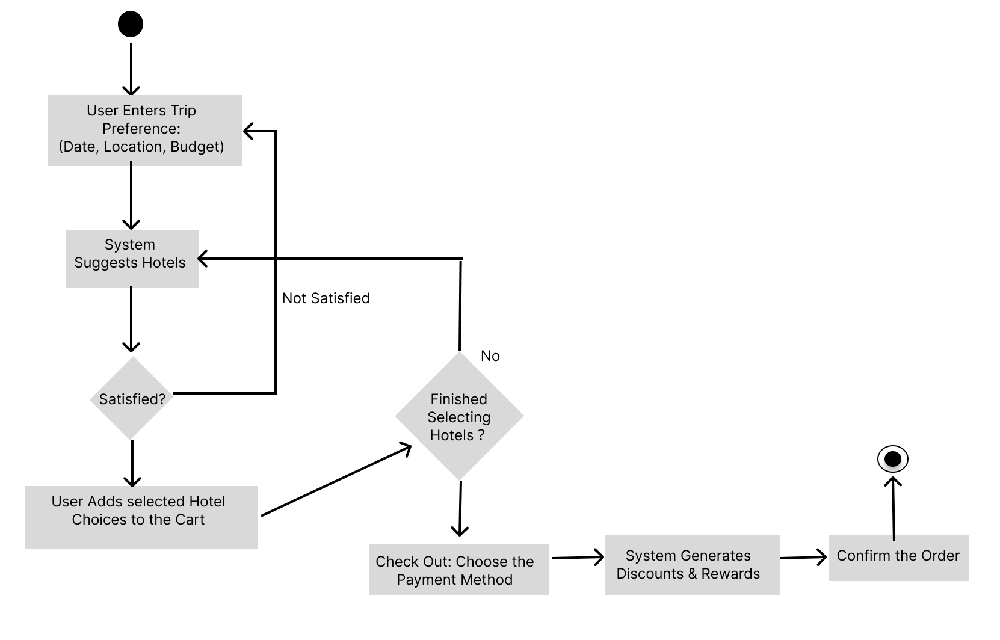

# Specification Phase Exercise

A little exercise to get started with the specification phase of the software development lifecycle. See the [instructions](instructions.md) for more detail.

## Team members

- [JunHao Chen](https://github.com/JunHaoChen16)
- [Maria Lee](https://github.com/MariaLuo826)
- [Ivan Wang](https://github.com/Ivan-Wang-tech)
- [qiexian-mf](https://github.com/qiexian-mf)
- [Serena Wang](https://github.com/serena0615)

## Stakeholders

### 1. Lucy Murph

- **Background:**
    - Retired state-owned enterprise engineer
    - Age: 64
    - Location: CA
    - Family: Lives with his wife
    - Lifestyle: Enjoys light exercises; would like to take domestic or international trips on a monthly basis

- **Frustrations:** 
    - Online travel guides are cluttered and rarely tailored to seniors.
    - Experienced a sudden closure of airports or scenic spots with no backup plans.
    - Traditional maps use small fonts and complicated menus, which are user-unfriendly to seniors
    - Unstable internet connection, losing navigation when needed

- **Desires:**
    - Prefer relaxing and comfortable trip itineraries with cafes and restaurants nearby for a break.
    - Plan 7-day trips with his wife, with clear daily schedules including sightseeing, meals, and rest times.
    - Share daily plans easily with his friends/families so that they can easily know where he is, ensuring safety
    - Minimize fatigue by avoiding complex transfers while travelling

### 2. Ziyi Zhang

- **Background:**
    - A recently graduated international student from China. He recently started working at an AI Infrastructure company. His side job is freelance photographer. Ziyi enjoys traveling during weekends and holidays, especially to destinations close to nature or places with iconic landmarks. He enjoys capturing scenery and unique local sights with his camera. His mbti is infp. 
    - Age: 27

- **Frustrations:** 
    - Need to optimize routes manually which often leads to spending too much time and energy
    - Switching between multiple apps (maps, travel guides, and etc.) is time consuming

- **Desires:**
    - budget-friendly trips without spending too much money.
    - Discover natural attractions
    - View iconic landmarks

### 3. Johnny Zhang

- **Background:**
    - UWM undergraduate students who like to travel with his friends, most of them are in different states. 
    - Age: 20

- **Frustrations:** 
    - Schedule conflicts between friends
    - Some trip participants may have budgets issue

- **Desires:**
    - Shared itinerary tool where all trip participants can view and edit the travel plan together
    - Voting features allows the group to quickly decide destination
    - Calculate per person cost for all activities

### 4. Binjie Zhao

- **Background:**
    - Binjie Zhao is a senior undergraduate student majoring in Mathematics at New York University. He      enjoys traveling during school breaks and public holidays, often exploring new cities or scenic spots with friends. Since he is still a student, he is budget-conscious and wants to save money while ensuring trips are fun and well-organized. He prefers apps that can help him and his friends plan together efficiently.
    - Age: 21

- **Frustrations:** 
    - Often overspends because he cannot track expenses during trips.
    - Finds it difficult to coordinate with friends since everyone uses different tools.
    - Needs to constantly switch between apps (maps, notes, ticket apps) which wastes time.
    - Sometimes misses good budget deals because he doesn’t know when to book transport or hotels.

- **Desires:**
    - Create a detailed travel plan that combines maps, schedules, and attractions.
    - Set a budget range for each trip and get cost estimates in advance.
    - Share and edit travel itineraries with friends to coordinate plans.
    - Find affordable accommodations, transport, and food options conveniently.

### 5. Anna Meyer 

- **Background:**
    - First time solo traveling after graduating University. Hopes to visit as many new places as possible on this new journey before starting a corporate life.
    - Age: 23

- **Frustrations:** 
    - Difficulty in finding affordable accommodations that are safe
    - Lack of schedule for public transportation
    - Nonoptimal itineraries that wastes large amounts of time and money

- **Desires:**
    - Recommendations of affordable and safe accommodations
    - Clear and detailed itinerary 
    - Optimized routes to visit as many new places as possible
    - Functionality to plan long trips in different locations

## Product Vision Statement

Our vision is to design a mobile app that helps travelers plan multi-day trips by combining accommodations, transportation schedules, and activities. 

## User Requirements

1. As a business traveler, I want quick sightseeing options near my meeting locations so that I can use my free hours effectively.
2. As a retired traveler on a limited budget, I want the app to suggest affordable attractions and transport options so that I can enjoy my trip without overspending. 
3. As a savvy traveler, I want the app to suggest the most cost-efficient hotels for my trip and show me all possible reward activities so that I can maximize savings and benefits.
4. As a retired international traveler, I want the offline map and real-time translation support so that I can navigate the city confidently without relying on mobile data.
5. As a retired RV road-tripper, I want the app to plan safe driving segments with rest areas, campgrounds, and fuel stops so that I can travel comfortably between towns each day.
6. As a traveler who travels with my friends, I want to create a shared trip itinerary so that my friends can see and edit the travel plan
7. As a traveler who travel with my friends, I want to invite friends to join my trip so that we are able to access it together
8. As a traveler who travel with my friends, I want to get notification when the itinerary was modified by others so that I can keep on track
9. As a traveler who travels with my friends, I want the app to calculate per person cost for each activity so I can manage my budget and split the bill.
10. As a traveler who travels with my friends, I want the app to have a voting feature so we can quickly decide where we should go.
11. As a young professional who recently started working, I want to view estimated transportation and ticket costs so that I can decide which attractions fit my budget.
12. As a part-time photographer, I want to easily discover photogenic locations so that I can capture high-quality photos for my portfolio.
13. As a spontaneous traveler who doesn’t want to spend much time on planning, I want the app to automatically optimize my routes and recommend nearby attractions in real time so that I can save time.
14. As a traveler visiting a new city, I want to see recommended attractions near my hotel so that I can plan my day more conveniently.
15. As a traveler, I want the app to generate a daily budget summary so that I can clearly see how much money I have spent and how much remains.
16. As a traveler who often travels with friends, I want the app to send reminders for bookings (flights, trains, hotels) so that we don’t miss deadlines or pay higher prices.
17. As a traveler exploring new destinations, I want the app to provide offline access to my itinerary and maps so that I can still navigate without internet connection.
18. As a traveler who values efficiency, I want the app to suggest optimized travel routes that combine attractions and transport options so that I can save both time and energy.
19. As a traveler, I want to be able to access public transport schedules.
20. As a traveler, I want access to affordable and safe accommodations.
21. As a traveler, I want a detailed travel itinerary that creates a tight schedule so I can maximize my time during the trip in a new country.
22. As a traveler, I want to create itineraries for my trip in multiple locations all at once.

## Activity Diagrams

This is the diagram of the third user requirement: "As a savvy traveler, I want the app to suggest the most cost-efficient hotels for my trip and show me all possible reward activities so that I can maximize savings and benefits."

This is the diagram of the thirteenth user requirement: "As a spontaneous traveler who doesn’t want to spend much time on planning, I want the app to automatically optimize my routes and recommend nearby attractions in real time so that I can save time."

## Clickable Prototype

[Clickable Prototype](https://www.figma.com/design/sA0vzezLxU3Zei5LZVRHD9/WireFrame-Diagram?node-id=0-1&p=f&t=k7MhQ4SLSWMtYAVY-0)
