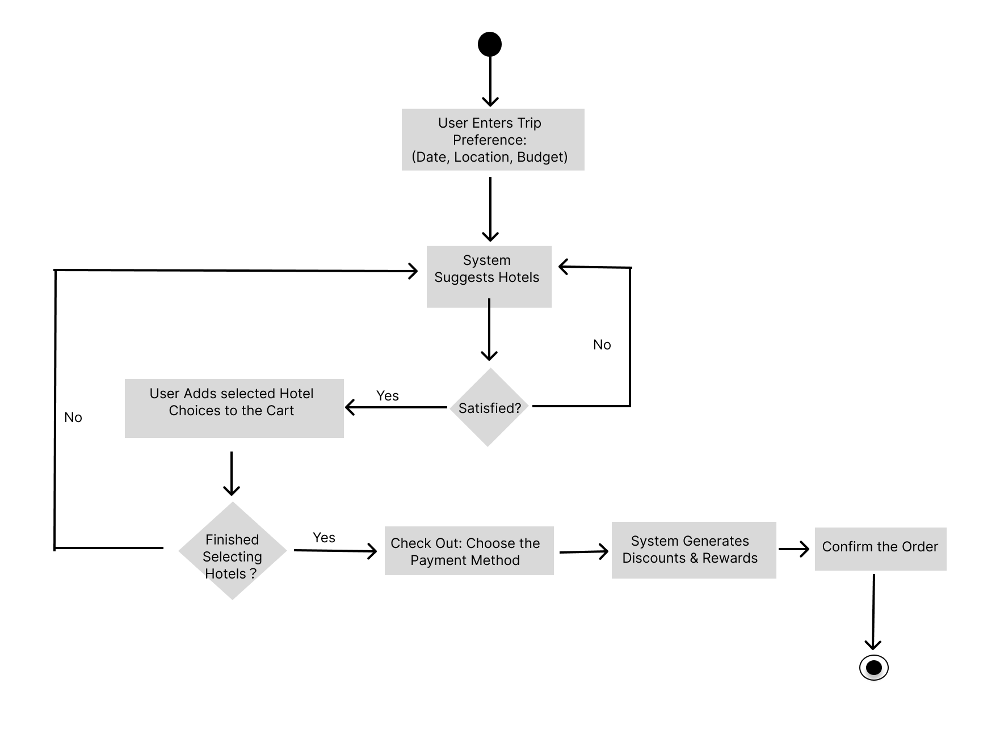

# Specification Phase Exercise

A little exercise to get started with the specification phase of the software development lifecycle. See the [instructions](instructions.md) for more detail.

## Team members

- [JunHao Chen](https://github.com/JunHaoChen16)
- [Maria Luo](https://github.com/MariaLuo826)
- [Ivan Wang](https://github.com/Ivan-Wang-tech)
- [qiexian-mf](https://github.com/qiexian-mf)
- [Serena Wang](https://github.com/serena0615)

## Stakeholders

1. Lucy Murph

Age: 64
Background: Retired state-owned enterprise engineer
Location: CA
Family: Lives with his wife
Lifestyle: Enjoys light exercises; would like to take domestic or international trips on a monthly basis

Desire:
1. Prefer relaxing and comfortable trip itineraries with cafes and restaurants nearby for a break.
2. Plan 7-day trips with his wife, with clear daily schedules including sightseeing, meals, and rest times.
3. Share daily plans easily with his friends/families so that they can easily know where he is, ensuring safety
Minimize fatigue by avoiding complex transfers while travelling

Frustration:
1. Online travel guides are cluttered and rarely tailored to seniors.
2. Experienced a sudden closure of airports or scenic spots with no backup plans.
3. Traditional maps use small fonts and complicated menus, which are user-unfriendly to seniors
4. Unstable internet connection, losing navigation when needed

## Product Vision Statement

Our vision is to design a mobile app that helps travelers plan multi-day trips by combining accommodations, transportation schedules, and activities. 

## User Requirements

1. As a business traveler, I want quick sightseeing options near my meeting locations so that I can use my free hours effectively.
2. As a retired traveler on a limited budget, I want the app to suggest affordable attractions and transport options so that I can enjoy my trip without overspending. 
3. As a savvy traveler, I want the app to suggest the most cost-efficient hotels for my trip and show me all possible reward activities so that I can maximize savings and benefits.
4. As a retired international traveler, I want the offline map and real-time translation support so that I can navigate the city confidently without relying on mobile data.
5. As a retired RV road-tripper, I want the app to plan safe driving segments with rest areas, campgrounds, and fuel stops so that I can travel comfortably between towns each day.

## Activity Diagrams

This is the diagram of the third user requirement: "As a savvy traveler, I want the app to suggest the most cost-efficient hotels for my trip and show me all possible reward activities so that I can maximize savings and benefits."

## Clickable Prototype

[clickable prototype](https://www.figma.com/design/sA0vzezLxU3Zei5LZVRHD9/WireFrame-Diagram?node-id=0-1&p=f&t=k7MhQ4SLSWMtYAVY-0)
